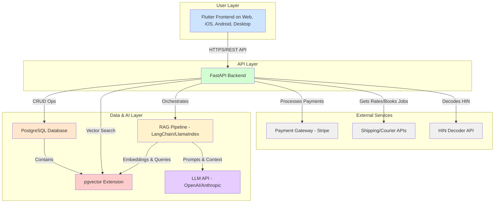
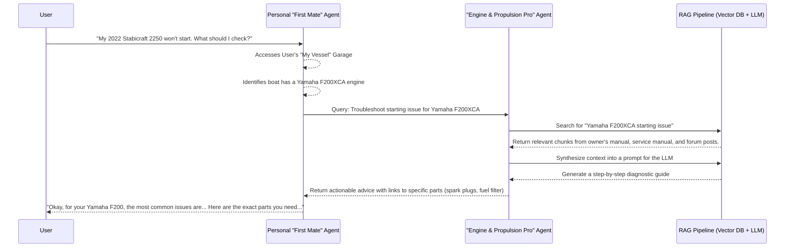

# Helm Platform: Full Product & Technical Specification

**Version:** 1.0  
**Date:** 22 February 2026  
**Author:** Manus AI

---

## 1. Introduction & Vision

This document provides a comprehensive technical and product specification for the **Helm** platform, a next-generation marine parts and accessories e-commerce ecosystem for the New Zealand market. 

The vision is to create a platform that is not merely a digital catalogue, but an intelligent, personalised co-pilot for boat ownership. By understanding the user's specific vessel, Helm will provide a level of service, accuracy, and proactive assistance that is currently absent from the market, creating a significant competitive advantage and a deeply loyal customer base.

This specification is intended to be sufficiently detailed for a competent development team to begin work following Feature-Driven Development (FDD) and Test-Driven Development (TDD) methodologies.

---

# Helm Platform: System Architecture & Design

This document outlines the proposed system architecture for the Helm platform.

## 1. Recommended Technology Stack

Based on the requirement for a single, unified codebase across Web, iOS, Android, Windows, and macOS, the following stack is recommended:

| Layer | Technology | Rationale |
|---|---|---|
| **Frontend (Client)** | **Flutter** | The leading framework for building natively compiled applications for mobile, web, and desktop from a single codebase. It provides high performance, a rich widget library, and excellent developer tooling, making it the most efficient choice for true cross-platform development. [1] |
| **Backend (Server)** | **Python 3.11+ with FastAPI** | FastAPI is a modern, high-performance web framework for building APIs with Python. It offers automatic data validation, interactive API documentation (via Swagger UI), and is built on asynchronous principles, making it ideal for handling I/O-bound tasks like database queries and calls to external AI services. [2] |
| **Primary Database** | **PostgreSQL 16+** | A powerful, open-source object-relational database system with a strong reputation for reliability, feature robustness, and performance. It is more than capable of handling standard e-commerce transactional data (users, orders, products). |
| **Vector Database** | **pgvector extension for PostgreSQL** | For the RAG (Retrieval-Augmented Generation) system, `pgvector` allows for storing and querying vector embeddings directly within our primary PostgreSQL database. This dramatically simplifies the tech stack, avoiding the need to manage a separate, dedicated vector database like Pinecone or Weaviate. It is highly performant for the scale of this project. [3] |
| **AI Orchestration** | **LangChain / LlamaIndex (Python)** | These frameworks provide the essential tools for building context-aware AI applications. They handle the core RAG pipeline: document loading, text splitting, embedding generation, vector store interaction, and chaining calls to the LLM. |
| **LLM Provider** | **OpenAI API (GPT-4 series) / Anthropic Claude 3** | The choice of Large Language Model will be a key factor. We should start with a high-capability model like GPT-4 or Claude 3 Opus for maximum reasoning ability, with the option to use smaller, faster models (like GPT-4.1-mini or Claude 3 Haiku) for less complex tasks to manage cost. |

## 2. System Architecture Diagram

## 3. AI Agent Orchestration Diagram

This diagram shows how the user's personal "First Mate" agent interacts with the domain-expert agents.

## References
[1] Flutter - The official Flutter website. (https://flutter.dev)
[2] FastAPI - The official FastAPI documentation. (https://fastapi.tiangolo.com)
[3] pgvector - GitHub repository for the pgvector extension. (https://github.com/pgvector/pgvector)
# Helm Platform: Core Feature Specifications (FDD/TDD)

This document provides detailed feature specifications in a format suitable for Feature-Driven Development (FDD) and Test-Driven Development (TDD). Each feature is broken down into user stories, acceptance criteria, and corresponding tests.

---

## Feature 1: The "My Vessel" Garage

**Overall Feature:** A user can create, view, update, and delete a detailed profile of their boat(s), which then personalises the entire platform experience.

### Story 1.1: Create a New Vessel Profile

*   **As a user, I want to add a new boat to my garage so that the platform knows what I own and can show me compatible parts.**

    *   **Acceptance Criteria:**
        1.  The user can initiate the "Add Vessel" flow from their account dashboard.
        2.  The user is prompted to enter their Hull Identification Number (HIN).
        3.  Upon entering a valid 12-character HIN, the system attempts to decode it via an external API.
        4.  If the HIN is successfully decoded, the `Manufacturer`, `Model Year`, and `Hull Serial Number` fields are automatically pre-populated and locked.
        5.  If the HIN cannot be decoded, the user can enter the `Manufacturer`, `Model`, and `Year` manually.
        6.  The user must give the vessel a `Nickname` (e.g., "My Stabi").
        7.  The user can optionally upload photos of their vessel.
        8.  Upon saving, the new vessel profile is created and associated with the user's account.
        9.  The new vessel appears in the user's "My Vessel" list.

    *   **Tests (TDD):**
        *   `test_add_vessel_button_present_on_dashboard()`
        *   `test_hin_input_accepts_12_chars()`
        *   `test_hin_api_called_with_valid_hin()`
        *   `test_form_prepopulated_on_successful_hin_decode()`
        *   `test_manual_entry_enabled_on_failed_hin_decode()`
        *   `test_nickname_is_required()`
        *   `test_vessel_creation_on_valid_form_submit()`
        *   `test_new_vessel_appears_in_garage_list()`

### Story 1.2: View a Vessel Profile

*   **As a user, I want to view the detailed profile of my boat so that I can see all its specifications and installed equipment in one place.**

    *   **Acceptance Criteria:**
        1.  The user can click on a vessel in their garage list to open its detail page.
        2.  The detail page displays the vessel's core information (Nickname, Manufacturer, Model, Year, HIN).
        3.  The page has a section for "Factory OEM Equipment" populated from the Boat OEM Database.
        4.  The page has a section for "User-Added Equipment" where the user can add items not in the OEM profile.
        5.  The page displays a "Service History" log.
        6.  The page displays the relevant "Voyage Spare Parts Checklists" for this vessel type.

    *   **Tests (TDD):**
        *   `test_vessel_detail_page_loads_on_click()`
        *   `test_core_info_is_displayed_correctly()`
        *   `test_oem_equipment_is_loaded_from_database()`
        *   `test_user_can_view_added_equipment()`
        *   `test_service_history_log_is_visible()`
        *   `test_checklists_are_displayed()`

### Story 1.3: Add/Edit Equipment on a Vessel Profile

*   **As a user, I want to add or edit the equipment on my boat's profile so that it accurately reflects its current state after upgrades or replacements.**

    *   **Acceptance Criteria:**
        1.  On the vessel detail page, the user can click an "Add Equipment" button.
        2.  A form appears allowing the user to select an `Equipment Category` (e.g., "Chartplotter", "VHF Radio").
        3.  The user can then enter the `Make` and `Model` of the new equipment.
        4.  Upon saving, the new equipment appears in the "User-Added Equipment" list.
        5.  If the user is adding equipment that completes an unverified profile from the crowdsourcing flow, a verification request is sent to the admin team.
        6.  The user can edit or remove any equipment they have added manually.

    *   **Tests (TDD):**
        *   `test_add_equipment_form_appears_on_click()`
        *   `test_can_add_new_equipment_with_category_make_model()`
        *   `test_new_equipment_appears_in_user_added_list()`
        *   `test_verification_request_triggered_for_profile_completion()`
        *   `test_user_can_edit_manually_added_equipment()`
        *   `test_user_can_remove_manually_added_equipment()`

---

## Feature 2: The Intelligent Product Catalogue

**Overall Feature:** A user can browse and search for products, with the catalogue automatically filtered to show only parts compatible with their selected vessel.

### Story 2.1: Browse Product Categories with Vessel Filter

*   **As a user with a vessel selected in my garage, I want to browse a product category and only see items that are compatible with my boat.**

    *   **Acceptance Criteria:**
        1.  The user has a primary vessel selected from their "My Vessel" garage (this is the "active vessel").
        2.  When the user navigates to a product category page (e.g., "Engine Parts > Fuel Filters"), the product listing is automatically filtered.
        3.  The filter logic uses the `compatible_products` table, which links products to the OEM equipment on the user's active vessel.
        4.  A clear message is displayed at the top of the page, e.g., "Showing parts compatible with *My Stabi* (2022 Stabicraft 2250)".
        5.  The user can clear the vessel filter to see all products in the category.

    *   **Tests (TDD):**
        *   `test_product_list_is_filtered_by_active_vessel()`
        *   `test_compatibility_message_is_displayed()`
        *   `test_filter_is_correctly_applied_based_on_vessel_equipment()`
        *   `test_user_can_clear_vessel_filter()`
        *   `test_all_products_shown_when_filter_is_cleared()`

### Story 2.2: Product Detail Page with Compatibility Confirmation

*   **As a user, I want to view a product's detail page and see a clear confirmation of whether it fits my selected vessel.**

    *   **Acceptance Criteria:**
        1.  On the product detail page, a prominent "Compatibility Check" widget is displayed.
        2.  If the user has an active vessel selected, the widget shows a clear message: "✓ Fits *My Stabi* (2022 Stabicraft 2250)" or "✗ Does Not Fit *My Stabi* (2022 Stabicraft 2250)".
        3.  If the user has no active vessel, the widget prompts them to select one from their garage to check compatibility.
        4.  The page also displays OEM part numbers and a list of all boat models this product is known to fit.

    *   **Tests (TDD):**
        *   `test_compatibility_widget_is_present()`
        *   `test_correct_fitment_message_shown_for_active_vessel()`
        *   `test_prompt_to_select_vessel_when_none_is_active()`
        *   `test_oem_part_numbers_are_displayed()`
        *   `test_list_of_compatible_models_is_displayed()`

---

## Feature 3: The "First Mate" AI Agent

**Overall Feature:** A user can interact with a conversational AI assistant that has deep knowledge of their vessel and can provide expert advice and product recommendations.

### Story 3.1: Ask a Technical Question

*   **As a user, I want to ask my First Mate a technical question about my boat and get a specific, accurate, and helpful answer.**

    *   **Acceptance Criteria:**
        1.  The user can open a chat interface to interact with their First Mate agent.
        2.  The user types a question (e.g., "What's the right oil for my engine?").
        3.  The First Mate agent identifies the user's active vessel and its specific equipment (e.g., Yamaha F200XCA engine).
        4.  It orchestrates a call to the relevant domain-expert agent (e.g., "Engine & Propulsion Pro").
        5.  The domain agent uses its RAG pipeline to find the answer from its knowledge base (manuals, guides).
        6.  The First Mate receives the answer and presents it to the user in a clear, conversational format.
        7.  The answer includes direct links to the specific products mentioned (e.g., the correct oil).

    *   **Tests (TDD):**
        *   `test_chat_interface_opens()`
        *   `test_user_message_is_sent_to_first_mate_agent()`
        *   `test_first_mate_correctly_identifies_active_vessel()`
        *   `test_correct_domain_agent_is_queried()`
        *   `test_rag_pipeline_is_invoked_with_correct_context()`
        *   `test_response_is_accurate_and_vessel_specific()`
        *   `test_response_contains_correct_product_links()`

---

## 4. Wireframes & Mock UI Designs

An interactive HTML prototype has been created to provide a visual and functional representation of the key user interface screens. This prototype serves as the definitive guide for the frontend development team.

The prototype includes the following screens:

1.  **Homepage:** The main landing page, featuring the hero section, search bar with compatibility filter, and top-level category navigation.
2.  **My Vessel Garage:** The user's dashboard for managing their boats, viewing details, and accessing vessel-specific tools.
3.  **Product Page:** The detail page for a single product, showcasing the intelligent compatibility check and service reminders.
4.  **First Mate AI:** The conversational interface for the AI assistant, demonstrating a typical user interaction for technical support and product recommendation.
5.  **Voyage Checklists:** The tiered spare parts checklist system, dynamically generated for the user's vessel.
6.  **Crew Loyalty Dashboard:** The interface for managing the team-based rewards programme, tracking points, and redeeming experiences.
7.  **Helm Dash Delivery:** The checkout flow for the on-demand maritime delivery service, including the map-based location selection.

**The interactive HTML file is provided as a separate deliverable (`helm_wireframes.zip`).** Developers should open the `index.html` file within this archive in a web browser to interact with the mockups.
