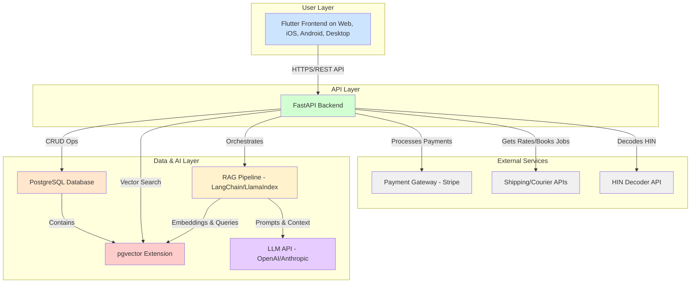
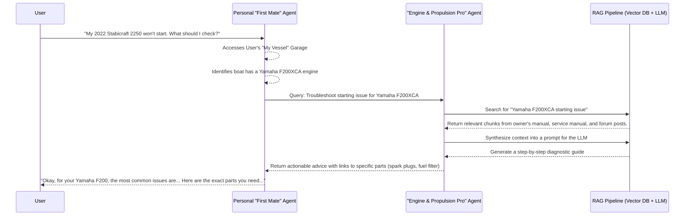

# Helm Platform: System Architecture & Design

This document outlines the proposed system architecture for the Helm platform.

## 1. Recommended Technology Stack

Based on the requirement for a single, unified codebase across Web, iOS, Android, Windows, and macOS, the following stack is recommended:

| Layer | Technology | Rationale |
|---|---|---|
| **Frontend (Client)** | **Flutter** | The leading framework for building natively compiled applications for mobile, web, and desktop from a single codebase. It provides high performance, a rich widget library, and excellent developer tooling, making it the most efficient choice for true cross-platform development. [1] |
| **Backend (Server)** | **Python 3.11+ with FastAPI** | FastAPI is a modern, high-performance web framework for building APIs with Python. It offers automatic data validation, interactive API documentation (via Swagger UI), and is built on asynchronous principles, making it ideal for handling I/O-bound tasks like database queries and calls to external AI services. [2] |
| **Primary Database** | **PostgreSQL 16+** | A powerful, open-source object-relational database system with a strong reputation for reliability, feature robustness, and performance. It is more than capable of handling standard e-commerce transactional data (users, orders, products). |
| **Vector Database** | **pgvector extension for PostgreSQL** | For the RAG (Retrieval-Augmented Generation) system, `pgvector` allows for storing and querying vector embeddings directly within our primary PostgreSQL database. This dramatically simplifies the tech stack, avoiding the need to manage a separate, dedicated vector database like Pinecone or Weaviate. It is highly performant for the scale of this project. [3] |
| **AI Orchestration** | **LangChain / LlamaIndex (Python)** | These frameworks provide the essential tools for building context-aware AI applications. They handle the core RAG pipeline: document loading, text splitting, embedding generation, vector store interaction, and chaining calls to the LLM. |
| **LLM Provider** | **OpenAI API (GPT-4 series) / Anthropic Claude 3** | The choice of Large Language Model will be a key factor. We should start with a high-capability model like GPT-4 or Claude 3 Opus for maximum reasoning ability, with the option to use smaller, faster models (like GPT-4.1-mini or Claude 3 Haiku) for less complex tasks to manage cost. |

## 2. System Architecture Diagram

## 3. AI Agent Orchestration Diagram

This diagram shows how the user's personal "First Mate" agent interacts with the domain-expert agents.

## References
[1] Flutter - The official Flutter website. (https://flutter.dev)
[2] FastAPI - The official FastAPI documentation. (https://fastapi.tiangolo.com)
[3] pgvector - GitHub repository for the pgvector extension. (https://github.com/pgvector/pgvector)
